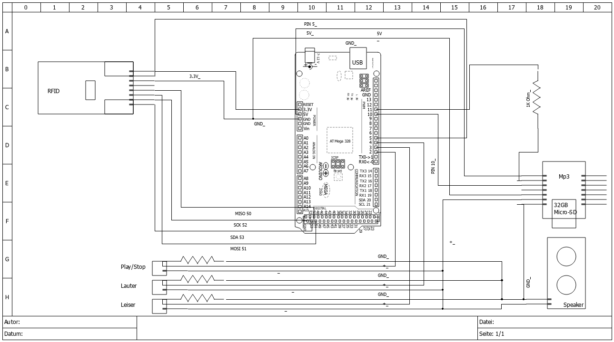

# hmyBox
TonieBox ist outdated und zu teuer.

## Arduino DIY

### Bauteile Prototyp I
- Arduino (Funduino) Mega 2560
- Breadboard
- Mini MP3 Player DFPlayer Master Module
- RFID-Modul RC522
- 1 - 2 x Lautsprecher 8ohm 3W
- 3 x 2 Pin Drückschalter (Taste)
- 3 x 1k Ohm Widerstand

### Schaltplan

### Code
#### Abhängigkeiten
- DFRobotDFPlayerMini
- MFRC522